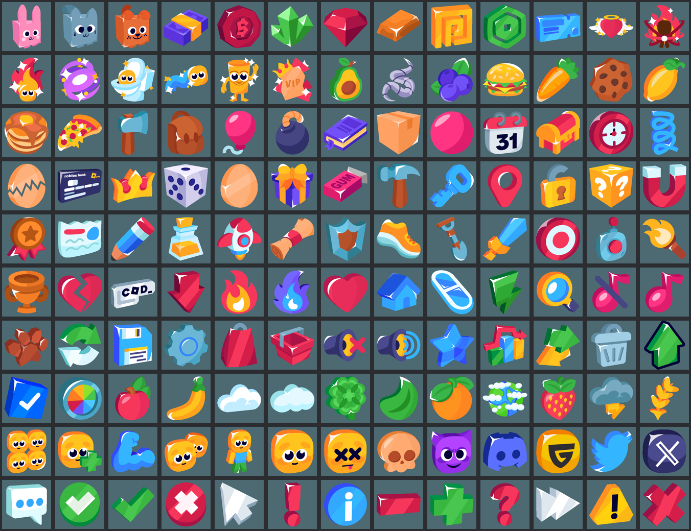

# Free Icon Pack v3.1 (Basic)

The vault owner supplied this pack on 2026-10-04. It's stored as `Free-Icon-Pack-v3.1-Basic.zip` in this folder: 2,446 files, 5.9 MB.
It suits bright simulator/tycoon UIs: chunky, glossy, cartoon 3D-ish icons with thick dark outlines.

## TL;DR
- **130 items × variants × 2 sizes (64px, 256px).** Upload the **256px** version and let Roblox scale it down. Use 64px only for tiny badges.
- Variants per item (not every item has all of them): `1st` (main colour), `2nd` (alt colour), `Outline` (1st/2nd with an extra outline,
  best on busy backgrounds), `Black` / `White` (flat silhouettes for monochrome UI or locked states), `Golden` (animals only: premium/rare tier).
- Use **one variant family across the whole game** (e.g. all `1st Outline`) for a consistent look. Use `Black` for locked/undiscovered
  Index entries and `Golden` for the premium/shiny tier.
- ⚠️ verify licence: the zip has **no licence file**. Before shipping, find the pack's source page and confirm commercial use and credit terms.

## Contents (folder → items)
| Category | Items |
|---|---|
| Animal | Bunny, Cat, Dog (+ Golden variants) |
| Currency | Cash, Coin, Crystal, Diamond, Ingot, Premium, Robux, Ticket |
| Exclusive | Angel Heart, Aura, Aura 2, Magical Teleport, Toilet with Head, Trail, Tung, VIP |
| Food | Avocado, Bait (Fishing), Blueberry, Burger, Carrot, Cookie, Lemon, Pancake, Pizza |
| Item | Axe, Backpack, Balloon, Bomb, Book, Box, Bubble Gum, Calendar, Chest, Clock, Coil, Cracked Egg, Credit Card, Crown, Dice, Egg, Gift, Gum, Hammer, Key, Location Pin, Lock, Lucky Block, Magnet, Medal, Newspaper, Pencil, Potion, Rocket, Scroll, Shield, Shoe, Shovel, Sword, Target, Teleporter, Torch, Trophy |
| Main | Broken Heart, Codes, Downgrade, Fire, Fire 2, Heart, House, Hoverboard, Lighting, Magnifying Glass, Music ON/OFF, Paw, Rebirth and Auto Open, Save, Settings, Shopping Bag, Shopping Cart, Sound ON/OFF, Star, Stats, Trade, Trash Can, Upgrade, Verify, Wheel |
| Nature | Apple, Banana, Cloud, Cloud 2, Clover, Leaf, Orange, Planet, Strawberry, Thunderstorm, Wheat |
| Player | 4 Players, Add Player, Arm, Friend, Full Body, Player, RIP, Skull, Smiling Face With Horns |
| Social | Discord, Guilded, Twitter, X |
| UI | Chat, Checkmark, Checkmark Button, Close Button, Cursor, Exclamation Mark, Info, Minus, Plus, Question Mark, Skip, Warning, X |

File path pattern: `Free Icon Pack v3.1 (Basic)/<Category>/<Item>/<64px|256px>/<Item> <Variant> <size>.png`
(a few folders are misnamed `256w`, e.g. Nature/Thunderstorm).

## Standard HUD mapping (use these by default)
| HUD element | Icon |
|---|---|
| Shop button | Main/Shopping Cart (or Shopping Bag) |
| Codes | Main/Codes |
| Rebirth | Main/Rebirth and Auto Open |
| Index / collection | Item/Book |
| Daily reward | Item/Calendar or Item/Gift |
| Free/timed reward | Item/Chest + Item/Clock |
| Spin wheel | Main/Wheel |
| Settings | Main/Settings; Sound/Music ON/OFF toggles |
| Trade | Main/Trade |
| Invite friends | Player/Add Player |
| Leaderboard / stats | Item/Trophy, Main/Stats |
| Teleport menu | Item/Teleporter or Item/Location Pin |
| Boost / multiplier | Item/Potion, Main/Lighting, Main/Upgrade |
| VIP gamepass | Exclusive/VIP |
| Close / confirm | UI/Close Button, UI/Checkmark Button |
| Primary currency | Currency/Coin or Cash; premium currency → Currency/Diamond or Crystal |
| Social links on menus | ⚠️ Roblox restricts off-platform links/logos in experiences. Check [[Moderation-And-Policy-Compliance]] before using the Discord/X/Twitter/Guilded icons |

## How to import
1. Unzip, then pick the variant family and size (256px).
2. Studio → **Asset Manager → Bulk Import** (or the 3D Importer for images) → upload the PNGs. Each becomes an `rbxassetid://` Image.
3. Record the IDs in the project's `Projects/<game>/` asset table (see [[Project-Template]]).
4. Use `ImageLabel`/`ImageButton` with `ScaleType = Fit` and a `UIAspectRatioConstraint` of 1. For press feedback see [[UI-Polish-And-Juice]].

## Related
- [[UI-Architecture]] · [[UI-Layout-And-Device-Scaling]] · [[UI-Polish-And-Juice]] · [[Art-Direction]] · [[Prompt-Library]] (UI polish prompt uses an icon pack)
