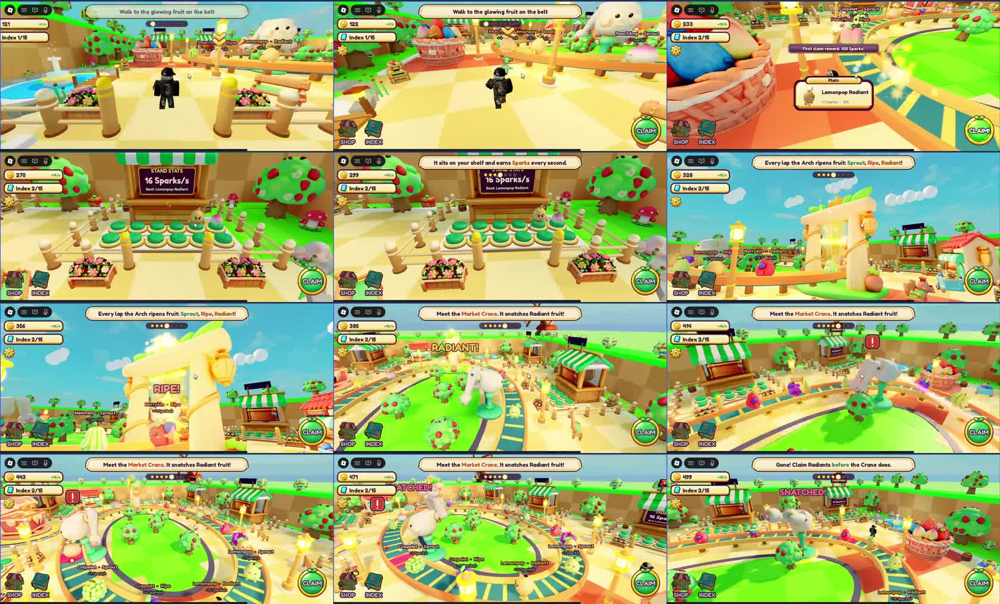
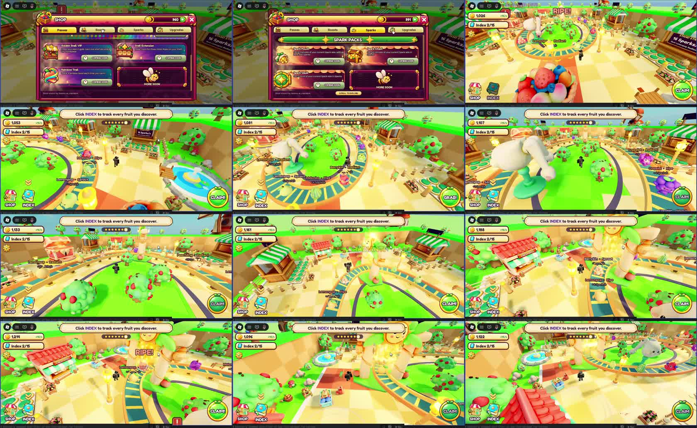
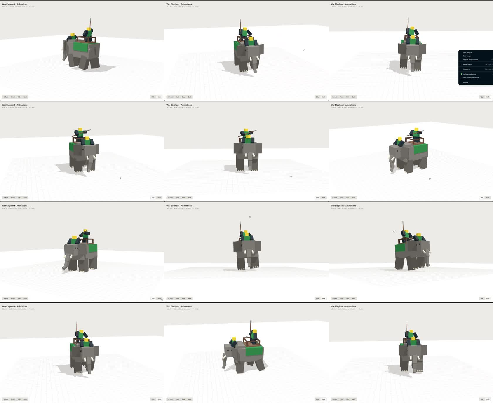
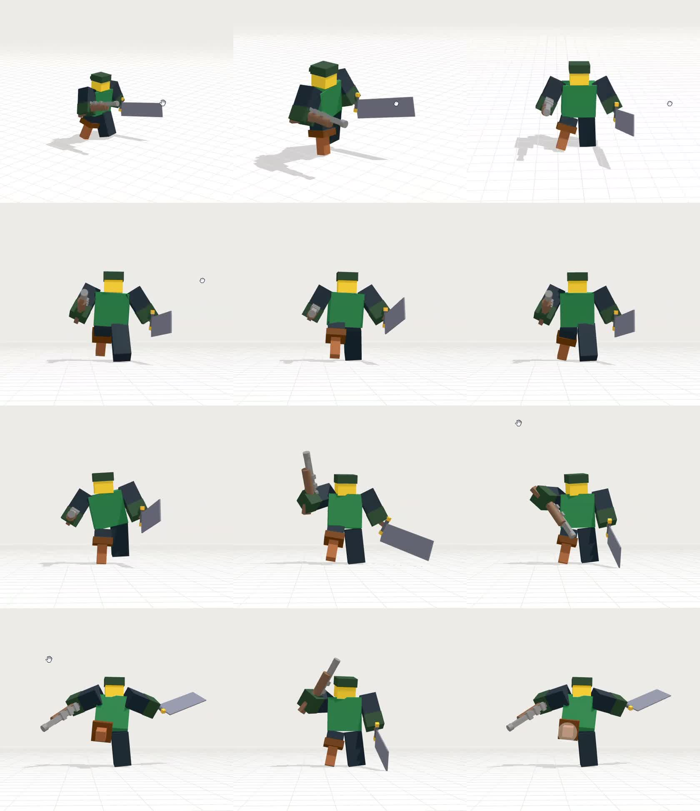
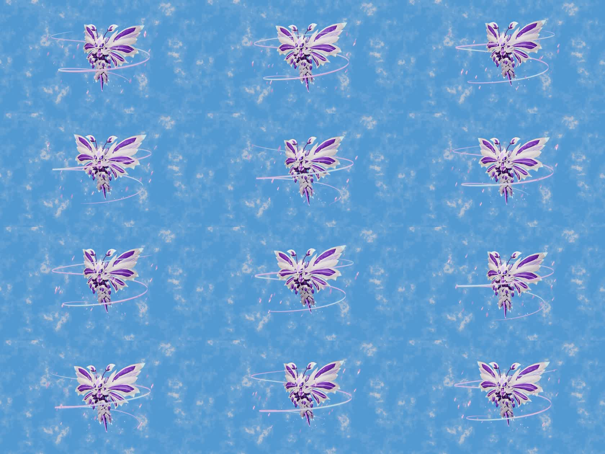

# Community Showcase Breakdowns (videos supplied by vault owner)

Frame-by-frame breakdowns of 5 short clips the vault owner supplied on 2026-10-04. Contact sheets (12 frames, evenly spaced) are stored in
`Assets/Reference-Captures/`. These clips show the current state of the art for AI-assisted Roblox work
(see [[AI-Assisted-Workflow]]).

## TL;DR — lessons to copy
- **Teach with a top-centre objective banner plus progress dots.** One short sentence per step, with key nouns coloured
  ("Meet the **Market Crane**…"). Never tell the player more than one thing at a time.
- **First reward inside ~20 s:** walk to the glowing fruit → claim → "First claim reward: 100 Sparks!" toast.
- **Keep the economy always visible:** currency with a live `+16/s` rate, plus an `Index 2/15` collection counter (top-left).
- **Use one giant contextual action button** (bottom-right, green, round) whose label changes with context (CLAIM → GRAB!).
- **Add an antagonist for urgency:** a crane steals your best fruit if you don't claim it in time. That turns an idle loop into an active one.
- **Scale dev products to income:** "Spark Pouch/Chest/Vault = X minutes of your current Spark rate". The packs stay
  relevant at every progression stage.

---

## 1–2. Fruit-stand conveyor tycoon (tutorial clip + shop/index clip)

**Core loop:**
1. Fruit rides a circular conveyor belt.
2. Each lap through **the Arch** upgrades its rarity tier: *Sprout → Ripe → Radiant*.
3. The player claims fruit onto **shelf slots at their stand**.
4. Each shelved fruit earns **Sparks per second** (passive income).
5. A **Market Crane** periodically snatches *Radiant* fruit off the belt ("SNATCHED!").

The player is pushed to claim at the right moment: wait for a better tier, but not so long that the crane steals it.
This is a risk/reward timing loop layered on idle income. It is close to the conveyor-steal genre ([[Genre-Playbooks]]).

**Onboarding sequence (banner text, in order):**
1. "Walk to the glowing fruit on the belt". A glowing target and a bouncing chevron mark it.
2. Claim → toast "First claim reward: 100 Sparks!", plus a card showing the fruit's name, tier and earn rate.
3. "It sits on your shelf and earns Sparks every second". The camera shows the stand's stats board: "16 Sparks/s, Best: Lemonpop Radiant".
4. "Every lap the Arch ripens fruit: Sprout, Ripe, Radiant!". The camera shows the arch, and a big "RIPE!" pop-up appears.
5. "Meet the Market Crane. It snatches Radiant fruit!". A red "!" warning marker appears above the crane.
6. "Gone! Claim Radiants before the Crane does." The game stages a loss to teach the rule.
7. "Click INDEX to track every fruit you discover." This introduces the collection meta-goal.

This teaches 5 systems in about 40 s, one at a time, each paired with a camera focus or world label. It matches [[Onboarding-And-First-60-Seconds]].

**HUD layout:**
- Top-left: currency pill with its rate (`1,053  +16/s`), an Index pill (`Index 2/15`), and a small settings cog.
- Top-centre: objective banner plus step dots.
- Bottom-left: labelled SHOP and INDEX square icon buttons.
- Bottom-right: a large round CLAIM/GRAB button with a fruit icon.
- World space: floating labels over each fruit (`Lemonpop · Radiant  +15 Sparks/s`), coloured by tier.

**Shop structure:** tabs **Passes / Boosts / Sparks / Upgrades**.
- Passes:
  - *Golden Stall VIP*: cosmetic gold stall and nameplate.
  - *Stall Extension*: more shelf slots.
  - *Rainbow Trail*: cosmetic.
- Sparks (dev products): *Spark Pouch / Chest / Vault*. Each grants N minutes of your **current** earn rate.
- A "MORE SOON" placeholder tile with a mascot bee signals that more is coming. A footer reads "Price shown by Roblox at checkout".
- Visual style: deep magenta/purple panels, gold header, green item cards, rounded corners, thick outlines. This clearly contrasts with the bright world.

**Art direction:** a saturated pastel world with a checkerboard plaza, round lollipop trees, chunky toy-like props, fruit
mascots with faces and warm lighting. It reads well at thumbnail size. See [[Art-Direction]].

**Improvement notes:**
- Hide the "coming soon" price buttons at launch. Empty shop tiles hurt conversion.
- Show locked silhouettes in the Index (the `Black` icon variant in [[Free-Icon-Pack-v3.1-Basic]]) to pull players toward collecting.

## 3. War elephant — reference-sheet model + animation viewer

- A blocky Roblox-style war elephant with a howdah carrying two R6-style riders (a spearman and a sitter).
- It is shown in a browser 3D viewer with **¾ front / Front / Side / Back** camera buttons and **Idle / Walk** toggles.
- This is the typical output of the "reference sheet → Claude Design" workflow in [[AI-Assisted-Workflow]] §5.
- Walk cycle: diagonal leg pairs and trunk sway, with the riders bobbing to the gait (secondary motion). It is a good benchmark for quadruped
  animation quality.
- Lesson: ask for a **preview viewer with fixed camera angles and animation toggles**. It makes reviewing each pass fast.

## 4. Pirate/soldier — attack animation set

- An R6-proportioned peg-leg pirate with a cleaver-sword (right hand) and flintlock (left hand), in the same viewer style.
- The clip shows idle → walk → several attacks:
  - an overhead pistol swing
  - a wide sword slash with both arms spread
  - a cross-body sweep

  The poses read clearly from the front view, with strong silhouettes and full extension at the key frame.
- Lesson: for combat, ask for clear **anticipation → strike → recovery** keyframes. Review them from the front view,
  since that's how most players will see them. See [[Animation-Rigging-And-IK]].

## 5. Crystal Bee — seamless VFX loop (Blender + AI)

- A 30 s seamless loop of a white/violet crystalline butterfly-bee: layered faceted wings, a segmented crystal abdomen,
  **2–3 orbiting ribbon trails** (pink/white, tilted at different angles) and drifting pink sparkle particles over a cloudy sky.
- It is the same creature as the "made this using Blender + Astra" advice in [[AI-Assisted-Workflow]] §1.
- How to rebuild it in Roblox:
  - Orbit rings: put a `Trail` on attachments parented to invisible parts, and rotate those parts by `CFrame` every frame
    (or use a `Beam` with curve size).
  - Sparkles: a `ParticleEmitter` with a small star texture, a low `Rate`, upward `Acceleration` and `LightEmission` around 1.
  - Crystal wings: `SurfaceAppearance` with an emissive-looking colour map, or `Material = Glass`/`Neon` accents.
  - See [[VFX-Particles-Beams-Trails]] and [[Shaders-Materials-And-Surfaces]].
- Lesson: a pet or creature reveal reads as premium when it combines **slow orbit motion, particles and a two-tone palette**.

## Related
- [[AI-Assisted-Workflow]] · [[Prompt-Library]] · [[Onboarding-And-First-60-Seconds]] · [[UI-Architecture]]
- [[Bundles-And-Starter-Packs]] · [[Gamepasses-vs-Developer-Products]] · [[Genre-Playbooks]] · [[Home]]

## Sources
- Five video clips supplied by the vault owner on 2026-10-04 (filenames dated 2026-10-01 to 2026-10-03, plus `CrystalBee_Seamless_v5_30s.mp4`).
