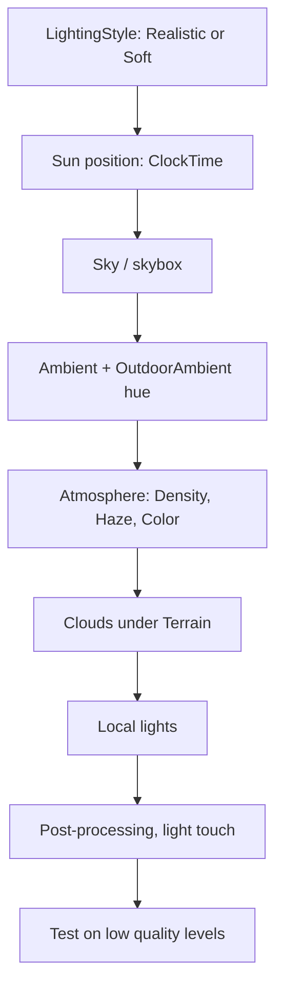

# Roblox Lighting Overview
Hub note for everything about lighting, skies, clouds, and mood in Roblox Studio. Start here, then follow the links.

## The stack (what actually makes a scene look the way it does)
| Layer | Where it lives | Note |
|---|---|---|
| Global light + look | `Lighting` service | [[Lighting Service Properties]] |
| Air, haze, depth | `Atmosphere` inside Lighting | [[Atmosphere]] |
| Sky, sun, moon, stars | `Sky` inside Lighting | [[Sky and Clouds]] |
| Clouds | `Clouds` inside **Terrain** (not Lighting) | [[Sky and Clouds]] |
| Local lights | PointLight / SpotLight / SurfaceLight | [[Local Lights and Performance]] |
| Screen filters | Bloom, ColorCorrection, SunRays, DoF... inside Lighting or Camera | [[Post-Processing]] |
| Ready-made looks + code | | [[Lighting Recipes]] |
| Links, videos, what to ignore | | [[Lighting Sources and Videos]] |

## Setup order that works

Why this order: the Atmosphere pulls most of its colors from the skybox, so pick the sky first. Ambient color should match the sky. Post-processing goes last because it only polishes what is already there.

## Quick checklist
- [ ] `LightingStyle` set on purpose (see heads-up below)
- [ ] `EnvironmentDiffuseScale` and `EnvironmentSpecularScale` raised to 1 if you use PBR/metal materials
- [ ] Sun placed where you want it (ClockTime), not left at the default high-noon spot
- [ ] Skybox lower half darker than upper half and close to terrain color
- [ ] Ambient + OutdoorAmbient tinted to match the sky, not default gray
- [ ] Atmosphere added (Density + Haze + Color)
- [ ] Clouds inserted under Terrain if wanted
- [ ] Only the lights that matter cast shadows
- [ ] Post-processing kept subtle (the common mistake is overdoing bloom, saturation, and depth of field)
- [ ] Checked at low graphics quality, ideally on a phone

## Heads-up: Technology vs LightingStyle
Many tutorials and TikToks still say "set Technology to Future". Roblox's current docs say `Lighting.Technology` has been **superseded** by `LightingStyle` (Soft = stylized, Realistic = naturalistic) plus `PrioritizeLightingQuality`. `Technology` is read-only from scripts and only editable in Studio. Details in [[Lighting Service Properties]].

## Working with Claude / Codex
- Lighting, Atmosphere, Sky, Clouds, and post-processing are all plain instances and properties, so an agent connected through the Studio MCP can set them with `execute_luau` (edit context). `Technology` cannot be set from scripts.
- Tell the agent to read [[Lighting Recipes]] and apply a preset, then take a screenshot to judge the result.
- Roblox's own hands-on practice places: [Lighting Outdoors - Start](https://www.roblox.com/games/17835285085/Lighting-Outdoors-Start) and [Complete](https://www.roblox.com/games/17835194683/Lighting-Outdoors-Complete).
